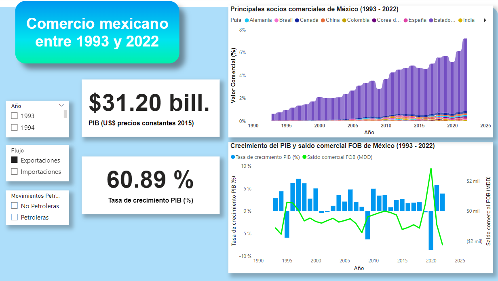
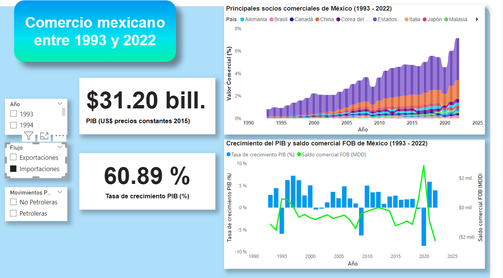

# Comercio mexicano entre 1993 y 2022
#Históricmente el principal socio comercial de México ha sido Estados Unidos, tanto por el lado de las exportaciones e importaciones.

# Pero por el lado de las importaciones desde inicios del siglo XXI México ha importado cada vez más mercancias y servicios de China, convirtiendose en el segundo socio comercial más importante de México, dezplazando a Estados Unidos.

# Esto tiene consecuencias directas sobre las decisiones y negociaciones sobre las medidas de origen en el T-MEC.
