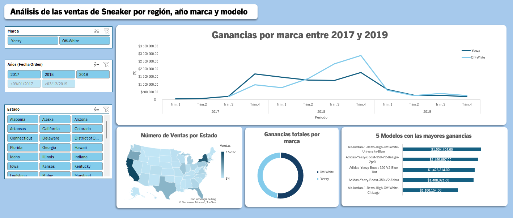
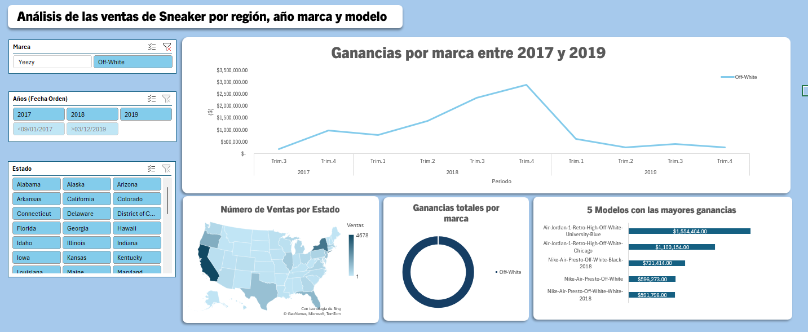
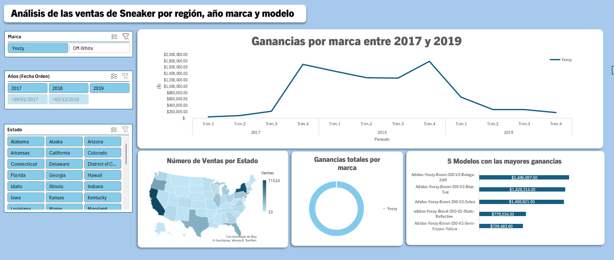
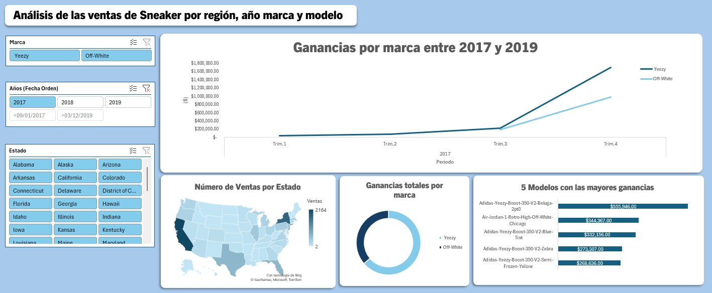
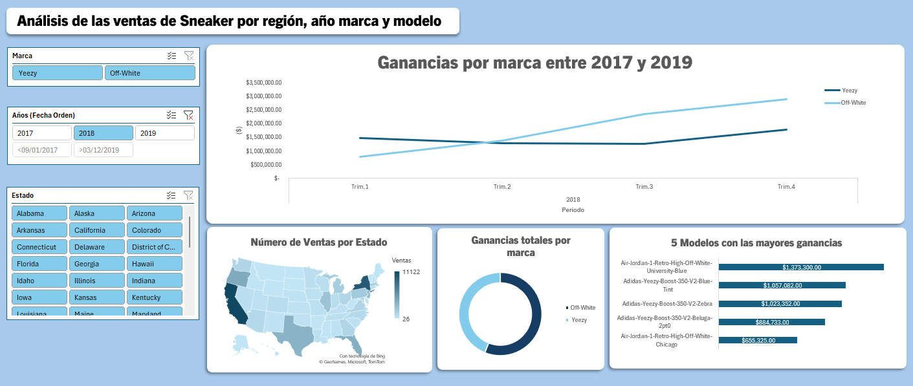
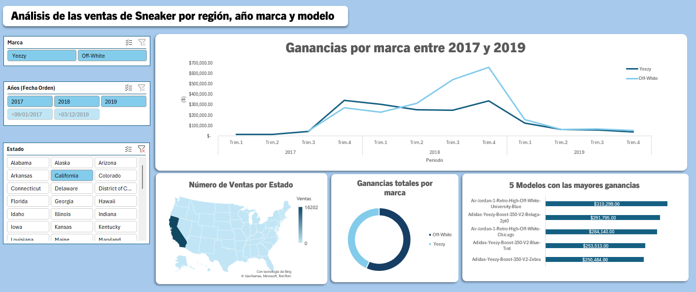
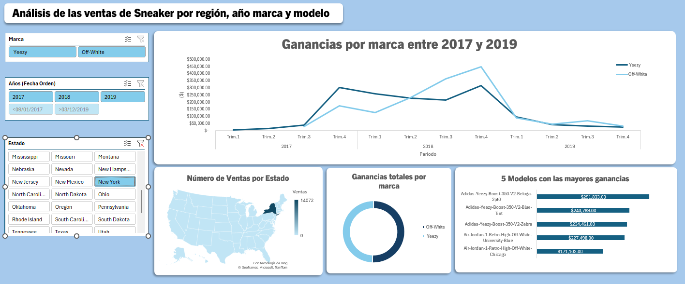

# Informe de ventas de Sneaker en Estados Unidos entre 2017 y 2019

# Por marca (Yeezy y Off-White)

# Off-White

# Yeezy

# Por año
# 2017

# 2018

# Por Estado

# California

# New York

# Hudson Stuck (2019) Fuente StockX Sneaker Data Contest. Kaggle. Sitio web: https://www.kaggle.com/datasets/hudsonstuck/stockx-data-contest
